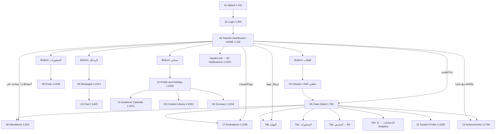

# Teacher Figma Flow Identification

**Status:** Documentation only — no code changes. Awaiting approval.  
**Date:** 2026-08-01  
**Figma file:
** [Basma (Copy)](https://www.figma.com/design/dvYE9COnQwosOVL3KCJVcp/Basma--Copy-?node-id=2-4394) (
`dvYE9COnQwosOVL3KCJVcp`)  
**Role frame:** **`المعلم`** — node **`2:4394`**  
**Method:** Plugin API text extraction (`use_figma`) + `get_screenshot` PNGs saved under
`docs/figma_teacher_refs/`.  
**Authority:** Frame title labels (`01 · …` / `B1 · …`) and visible Arabic copy in the node tree —
not prior audit captions.

### Correction to prior audit

`TEACHER_HOME_UI_AUDIT.md` concluded that `2:4394` was a student shell. That was **incorrect**.
Re-inspection via text nodes shows a full **Teacher** flow. MCP image captions had misread several
screens as student UI; local PNG review of `03_dashboard_1-432.png` and `06_attendance_1-914.png`
confirms teacher content.

---

## 1. Every Teacher-related frame / page

Parent: **`المعلم` (`2:4394`)** → child strip **`Frame 3` (`2:4393`)** → 19 phone `Container`s (each
labeled with a screen title in a badge).

| #  | Frame ID | Title (from Figma text)                        | Figma link                                                                              | Local screenshot                                                           |
|----|----------|------------------------------------------------|-----------------------------------------------------------------------------------------|----------------------------------------------------------------------------|
| 01 | `1:311`  | **01 · SPLASH SCREEN**                         | [open](https://www.figma.com/design/dvYE9COnQwosOVL3KCJVcp/Basma--Copy-?node-id=1-311)  | `docs/figma_teacher_refs/01_splash_1-311.png`                              |
| 02 | `1:354`  | **02 · LOGIN** (بوابة المعلم)                  | [open](https://www.figma.com/design/dvYE9COnQwosOVL3KCJVcp/Basma--Copy-?node-id=1-354)  | `docs/figma_teacher_refs/02_login_1-354.png`                               |
| 03 | `1:432`  | **03 · TEACHER DASHBOARD**                     | [open](https://www.figma.com/design/dvYE9COnQwosOVL3KCJVcp/Basma--Copy-?node-id=1-432)  | `docs/figma_teacher_refs/03_dashboard_1-432.png`                           |
| 04 | `1:632`  | **04 · CLASSES** (حلقاتي)                      | [open](https://www.figma.com/design/dvYE9COnQwosOVL3KCJVcp/Basma--Copy-?node-id=1-632)  | `docs/figma_teacher_refs/04_classes_1-632.png`                             |
| 05 | `1:769`  | **05 · CLASS DETAIL — STUDENTS**               | [open](https://www.figma.com/design/dvYE9COnQwosOVL3KCJVcp/Basma--Copy-?node-id=1-769)  | `docs/figma_teacher_refs/05_class_detail_1-769.png`                        |
| 06 | `1:914`  | **06 · ATTENDANCE** (الحضور والغياب)           | [open](https://www.figma.com/design/dvYE9COnQwosOVL3KCJVcp/Basma--Copy-?node-id=1-914)  | `docs/figma_teacher_refs/06_attendance_1-914.png`                          |
| 07 | `1:1056` | **07 · EVALUATIONS** (التقييمات)               | [open](https://www.figma.com/design/dvYE9COnQwosOVL3KCJVcp/Basma--Copy-?node-id=1-1056) | `docs/figma_teacher_refs/07_evaluations_1-1056.png`                        |
| 08 | `1:1188` | **08 · POSTS / ANNOUNCEMENTS** (المنشورات)     | [open](https://www.figma.com/design/dvYE9COnQwosOVL3KCJVcp/Basma--Copy-?node-id=1-1188) | `docs/figma_teacher_refs/08_posts_1-1188.png`                              |
| 09 | `1:1314` | **09 · MESSAGES** (الرسائل)                    | [open](https://www.figma.com/design/dvYE9COnQwosOVL3KCJVcp/Basma--Copy-?node-id=1-1314) | `docs/figma_teacher_refs/09_messages_1-1314.png`                           |
| 10 | `1:1405` | **10 · CHAT VIEW**                             | [open](https://www.figma.com/design/dvYE9COnQwosOVL3KCJVcp/Basma--Copy-?node-id=1-1405) | `docs/figma_teacher_refs/10_chat_1-1405.png`                               |
| 11 | `1:1500` | **11 · ANALYTICS DASHBOARD** (لوحة التحليلات)  | [open](https://www.figma.com/design/dvYE9COnQwosOVL3KCJVcp/Basma--Copy-?node-id=1-1500) | `docs/figma_teacher_refs/11_analytics_1-1500.png`                          |
| 12 | `1:1658` | **12 · STUDENT PROFILE**                       | [open](https://www.figma.com/design/dvYE9COnQwosOVL3KCJVcp/Basma--Copy-?node-id=1-1658) | *Screenshot rate-limited this pass — use Figma link*                       |
| 13 | `1:1784` | **13 · ACHIEVEMENTS** (منح الجوائز)            | [open](https://www.figma.com/design/dvYE9COnQwosOVL3KCJVcp/Basma--Copy-?node-id=1-1784) | Captured earlier as MCP asset; re-open via Figma link if local PNG missing |
| 14 | `1:1871` | **14 · ACADEMIC CALENDAR** (التقويم الأكاديمي) | [open](https://www.figma.com/design/dvYE9COnQwosOVL3KCJVcp/Basma--Copy-?node-id=1-1871) | *Rate-limited — use Figma link*                                            |
| 15 | `1:2035` | **15 · PROFILE & SETTINGS**                    | [open](https://www.figma.com/design/dvYE9COnQwosOVL3KCJVcp/Basma--Copy-?node-id=1-2035) | *Rate-limited — use Figma link*                                            |
| B1 | `1:2155` | **B1 · EXCUSES** (طلبات الاعتذار)              | [open](https://www.figma.com/design/dvYE9COnQwosOVL3KCJVcp/Basma--Copy-?node-id=1-2155) | `docs/figma_teacher_refs/B1_excuses_1-2155.png`                            |
| B2 | `1:2250` | **B2 · NOTIFICATIONS** (الإشعارات)             | [open](https://www.figma.com/design/dvYE9COnQwosOVL3KCJVcp/Basma--Copy-?node-id=1-2250) | `docs/figma_teacher_refs/B2_notifications_1-2250.png`                      |
| B3 | `1:2350` | **B3 · CONTENT LIBRARY** (مكتبة المحتوى)       | [open](https://www.figma.com/design/dvYE9COnQwosOVL3KCJVcp/Basma--Copy-?node-id=1-2350) | *Rate-limited — use Figma link*                                            |
| B4 | `1:2479` | **B4 · MEDIA GALLERY** (المعرض)                | [open](https://www.figma.com/design/dvYE9COnQwosOVL3KCJVcp/Basma--Copy-?node-id=1-2479) | `docs/figma_teacher_refs/B4_gallery_1-2479.png`                            |

**Note:** Canvas X-order of containers is **not** the same as screen numbers (e.g. Attendance
`1:914` sits left of Classes `1:632`). Use title badges / IDs, not left-to-right position.

**Other role frames on the same page (not Teacher):** ولي الأمر `31:4117`, الإشراف `32:9680`, الطالب
`41:4424`, الإدارة `69:5034`, Html→Body auth strip `76:9256`.

---

## 2. Navigation flow (as designed)



### Bottom navigation on Teacher Home (`1:432`)

RTL order (right → left):

| Tab                | Arabic    | Primary destination frame                           |
|--------------------|-----------|-----------------------------------------------------|
| 1 (active on Home) | الرئيسية  | `1:432` Teacher Dashboard                           |
| 2                  | الطلاب    | `1:632` Classes (حلقاتي) — tab label ≠ screen title |
| 3                  | المنشورات | `1:1188` Posts                                      |
| 4                  | الرسائل   | `1:1314` Messages                                   |
| 5                  | حسابي     | `1:2035` Profile & Settings                         |

Header on Home: **notifications** + **search** (search target not given a dedicated titled frame).

### Class Detail inner tabs (`1:769`)

الطلاب · الحضور · التقييمات · **المهام** · المنشورات · المعرض · الإحصائيات

---

## 3. Actual Teacher Home

| Field          | Value                                                                          |
|----------------|--------------------------------------------------------------------------------|
| **Frame ID**   | **`1:432`**                                                                    |
| **Title**      | **03 · TEACHER DASHBOARD**                                                     |
| **Role**       | Post-login **Home** (bottom tab الرئيسية selected)                             |
| **Screenshot** | `docs/figma_teacher_refs/03_dashboard_1-432.png`                               |
| **Link**       | https://www.figma.com/design/dvYE9COnQwosOVL3KCJVcp/Basma--Copy-?node-id=1-432 |

**Home contents (summary):** teacher identity header, greeting + Hijri date, 2×2 stats (حصص اليوم /
إجمالي الطلاب / مهام معلقة / رسائل جديدة), next-session card with **ابدأ الجلسة**, admin
announcement, **النشاطات الأخيرة**, smart-assistant card (**ما الذي تريد إنجازه اليوم؟** with pills:
رفع التقييمات / إرسال مهمة / طلاب في خطر), 5-tab bottom nav.

---

## 4. Concept → frame mapping (requested surfaces)

| Concept           | Status                                        | Frame ID                       | Title                                                            | Notes                                                                                                                                                                                                |
|-------------------|-----------------------------------------------|--------------------------------|------------------------------------------------------------------|------------------------------------------------------------------------------------------------------------------------------------------------------------------------------------------------------|
| **Teacher Home**  | **Present**                                   | `1:432`                        | 03 · TEACHER DASHBOARD                                           | Canonical Home                                                                                                                                                                                       |
| **Today's Work**  | **No dedicated frame** — **embedded in Home** | `1:432`                        | (same)                                                           | Stats «حصص اليوم» / «مهام معلقة», session card, smart assistant «ما الذي تريد إنجازه اليوم؟». **Missing:** standalone screen titled عمل اليوم / Today's Work matching app W3 agenda-only composition |
| **Attendance**    | **Present**                                   | `1:914`                        | 06 · ATTENDANCE                                                  | Also linked from Class Detail tab الحضور                                                                                                                                                             |
| **Students**      | **Present (two levels)**                      | `1:632` + `1:769` (+ `1:1658`) | 04 · CLASSES, 05 · CLASS DETAIL — STUDENTS, 12 · STUDENT PROFILE | Bottom tab «الطلاب» → classes list; roster on 05; per-student on 12                                                                                                                                  |
| **Homework**      | **Missing as dedicated screen**               | —                              | —                                                                | Closest: Class Detail tab **المهام**; Home pill **إرسال مهمة**. **No** titled frame for واجب / تكليف / assign homework                                                                               |
| **Reviews**       | **Present** (as Evaluations)                  | `1:1056`                       | 07 · EVALUATIONS                                                 | Recitation/behavior/review grades UI                                                                                                                                                                 |
| **Awards**        | **Present**                                   | `1:1784`                       | 13 · ACHIEVEMENTS                                                | منح الجوائز                                                                                                                                                                                          |
| **Notifications** | **Present**                                   | `1:2250`                       | B2 · NOTIFICATIONS                                               | From Home bell                                                                                                                                                                                       |
| **Profile**       | **Present**                                   | `1:2035`                       | 15 · PROFILE & SETTINGS                                          | Bottom tab حسابي                                                                                                                                                                                     |

### Explicitly missing (no titled Teacher frame)

| Screen / concept                                     | Verdict                                       |
|------------------------------------------------------|-----------------------------------------------|
| Dedicated **Today's Work / عمل اليوم** (agenda-only) | **Missing** (only embedded on Home)           |
| Dedicated **Homework / إرسال واجب**                  | **Missing** (only المهام tab + Home CTA pill) |
| Dedicated **Search results** (Home search icon)      | **Missing**                                   |
| App W3 closeout states as named Figma screens        | **Missing**                                   |

### Present but outside the requested list (for completeness)

| Frame             | ID                 |
|-------------------|--------------------|
| Splash / Login    | `1:311`, `1:354`   |
| Posts             | `1:1188`           |
| Messages / Chat   | `1:1314`, `1:1405` |
| Analytics         | `1:1500`           |
| Academic calendar | `1:1871`           |
| Excuses           | `1:2155`           |
| Content library   | `1:2350`           |
| Media gallery     | `1:2479`           |

---

## 5. Screenshot reference index

Saved locally (this session):

```
docs/figma_teacher_refs/
  01_splash_1-311.png
  02_login_1-354.png
  03_dashboard_1-432.png          ← Teacher Home
  04_classes_1-632.png
  05_class_detail_1-769.png
  06_attendance_1-914.png
  07_evaluations_1-1056.png
  08_posts_1-1188.png
  09_messages_1-1314.png
  10_chat_1-1405.png
  11_analytics_1-1500.png
  B1_excuses_1-2155.png
  B2_notifications_1-2250.png
  B4_gallery_1-2479.png
```

Not saved locally due to Figma MCP rate limit (use Figma links in §1):

- `1:1658` Student Profile
- `1:1784` Achievements (screenshot was taken earlier in session; re-export if needed)
- `1:1871` Academic Calendar
- `1:2035` Profile & Settings
- `1:2350` Content Library

---

## 6. Approval gate

**Stop here.** No implementation until you confirm:

1. **Teacher Home SSOT** = Figma **`1:432`** (03 · TEACHER DASHBOARD), and
2. How to treat **Missing** items (Homework dedicated screen, standalone Today's Work) vs app W3
   agenda, and
3. Whether bottom tab **الطلاب** should map to Classes (`1:632`) as drawn.

Awaiting approval.
